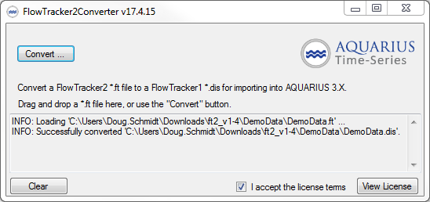

# FlowTracker2Converter

This standalone utility will allow AQUARIUS 3.X customers to read FlowTracker2 device measurements.

It converts `*.ft` measurement files into FlowTracker1 `*.dis` discharge summary files which can then be imported into AQTS 3.X.

Simply drag and drop your files onto the GUI app, and your file will be converted to a `*.dis` file in the same folder as the original `*.ft` file.

## Requirements

- No installer needed. Just run the EXE from wherever.
- The converter requires the .NET 4.7 runtime to be installed
    - .NET 4.7 is pre-installed on Windows 10 and Windows 2012 Server, and on most Windows 7 systems.
    - .NET 4.7 is available [here](https://www.microsoft.com/en-us/download/details.aspx?id=55167) if you need to install it manually.
